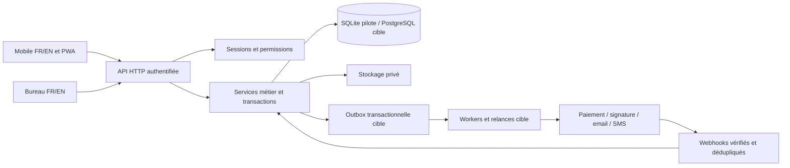

# Burnt mills investment LLC

## Architecture fonctionnelle et technique — 13 septembre 2026

Ce dossier précède le développement. Source : `Prompt_Application_Construction_Renovation_USA.docx`, lu dans le dossier de l’entreprise, et les 30 rubriques transmises. Les trois logos sont disponibles. Aucun fichier ne fournit de clients, employés, adresse professionnelle, numéro de licence, tarifs ni données financières réelles. Toutes les données de démonstration devront être signalées et séparées des données de travail.

Décision initiale : application web responsive FR/EN avec manifeste installable, utilisable sur ordinateur et téléphone après hébergement HTTPS. Une application publiée sur les stores constitue une phase distincte. Première livraison locale autonome avec Node 24 et SQLite, sans dépendance npm. Architecture cible : API modulaire, PostgreSQL, stockage objet privé et traitements asynchrones. La première version locale n’est pas une certification de sécurité, une application native ni une plateforme SaaS opérationnelle.

## 1 Analyse fonctionnelle

Le projet est le dossier opérationnel central ; le client est le dossier commercial ; les documents financiers sont versionnés. Une opportunité gagnée ne doit jamais être confondue avec un paiement reçu. Le calendrier, les tâches, le budget et les documents doivent référencer le même projet.

| Domaine | Fonctions attendues | Critère de réception cible |
|---|---|---|
| Direction | CA, facturé, encaissé, reste à recevoir, dépenses, marges, conversions | Chaque indicateur se réconcilie avec les écritures sources et la période choisie |
| CRM | Particuliers, sociétés, promoteurs, architectes, partenaires ; pipeline à 7 étapes | Historique lié au client, recherche, coordonnées américaines, confidentialité des notes |
| Estimation | Lignes travaux, quantités, prix, catégories, remise, taxes, marge | Total calculé côté serveur, devise USD, révision figée à l’acceptation |
| Contrat | Périmètre, échéancier, acompte, responsabilités, garanties, signatures | Modèle validé, preuve de consentement, horodatage et copie immuable |
| Chantier | Client, équipe, dates, budget, phases, progression, statuts | Un devis accepté ne crée pas deux projets lors d’une double soumission |
| Tâches | Responsable, priorité, échéance, état, commentaires, fichiers | Vue terrain et retards calculés, historique des modifications |
| Planning | Jour, semaine, mois, équipe ; livraisons et inspections | Détection des chevauchements d’une personne et des affectations |
| Ressources | Employés et sous-traitants distincts, compétences, taux, documents | Alertes de documents expirants et accès limités aux affectations |
| Temps | Arrivée, départ, projet, notes, validation | Un seul pointage ouvert par employé, correction tracée, coût sans doublon |
| Budget | Prévision/réel par poste, reçus et marge | Revenus, engagements et encaissements restent distincts |
| Achats | Fournisseurs, stock, commandes, livraisons | Quantités livrées et consommées traçables, livraison partielle permise |
| Factures | Acompte, situation, solde, taxes, échéance | Numéro unique, facture émise figée, correction par avoir |
| Paiements | Carte, PayPal, partiels, rapprochement et reçus | Aucun paiement déclaré réussi par simple retour du navigateur |
| Relances | Avant, à et après échéance, email/SMS/interne | Arrêt après règlement, absence de doublons, journal d’envoi |
| Photos | Appareil mobile, avant/pendant/après, date/auteur/phase | Photo liée au projet, permission vérifiée au téléchargement |
| Documents | Plans, contrats, permis, reçus, assurances, garanties | Liens temporaires ou route authentifiée, version et audience explicites |
| Messages | Échanges par chantier, internes ou partagés | Le client ne voit jamais les notes internes |
| Portail | Projets et documents autorisés du client | Tests avec deux clients distincts, aucune fuite par identifiant direct |
| Conformité | État, comté, ville, règles effectives et expiration | Aucune règle nationale inventée ; validation juridictionnelle enregistrée |
| Rapports | Rentabilité, conversion, temps, coûts, impayés ; PDF/CSV | Export conforme aux filtres et aux permissions |

## 2 États et règles métier

Prospect : nouveau → contacté → rendez-vous → devis envoyé → négociation → gagné/perdu. Perdu exige une raison ; réouverture conservée dans l’historique.

Devis : brouillon → envoyé → accepté/refusé/expiré. Une modification après envoi crée une nouvelle révision. Conversion acceptée : contrat brouillon et projet planifié, dans une transaction idempotente ; la conversion ne signifie pas signature du contrat. Avenants séparés après signature.

Projet : planifié → préparation → en cours → en attente/retardé → terminé → clôturé. Clôture avec tâches, inspection, réserves, remise documentaire et état financier contrôlés. Progression manuelle justifiée dans le pilote ; pondération des phases à définir pour la cible.

Phases : préparation, démolition, fondation, structure, plomberie, électricité, HVAC, toiture, isolation, drywall, peinture, revêtement, finition, inspection, livraison. Elles sont configurables selon le chantier.

Facture : brouillon → envoyée → partielle/payée ; retard calculé si solde positif et échéance passée. Annulation selon politique comptable ; facture ayant reçu un paiement corrigée par avoir et remboursement, pas supprimée.

Commande : à commander → commandée → expédiée → livrée → utilisée, avec lignes et livraisons partielles en cible.

Argent : entiers en cents ; taux de taxe en points de base ; arrondi par ligne et total documenté. Quantité décimale à précision définie. Taxe configurable par catégorie et juridiction en cible ; aucun taux fiscal présumé correct. Fuseaux IANA, instants UTC, dates de chantier au fuseau du projet. Un changement de langue ne traduit pas le texte libre saisi par les utilisateurs.

Marge prévisionnelle = valeur contractuelle HT − coûts prévisionnels. Marge estimée = valeur contractuelle HT + avenants approuvés − dépenses HT − heures approuvées valorisées − autres coûts constatés. Les montants de sous-traitance déjà comptés dans les dépenses ne sont pas additionnés deux fois. Trésorerie = encaissements − décaissements ; elle n’est pas le bénéfice comptable. Le pilote affiche explicitement les données financières saisies, sans reconnaissance comptable automatique du CA.

## 3 Rôles et permissions

Le serveur décide des droits. Masquer un bouton ne constitue pas un contrôle d’accès. Tous les accès sont limités à l’entreprise ; les rôles opérationnels sont en plus limités aux projets affectés. Les exports appliquent les mêmes restrictions que l’API.

| Rôle | Lecture | Écriture | Interdictions principales |
|---|---|---|---|
| Super Admin | Tous domaines de son entreprise | Paramètres et utilisateurs compris | Pas d’accès implicite à une autre entreprise |
| Direction | Commercial, finances, projets, équipes, rapports | Gestion complète hors administration de plateforme | Secrets techniques non exposés |
| Project Manager | Projets affectés, budgets autorisés, équipe, documents | Planning, tâches, achats et suivi affectés | Gestion des utilisateurs et paiements réservée |
| Chef de chantier | Projets affectés et documents opérationnels | Tâches, photos, incidents, progression, temps | Finance globale et notes commerciales |
| Employé | Ses tâches, temps et projets affectés | Son pointage, commentaires et photos | Taux d’autres personnes, budget global |
| Sous-traitant | Ses projets et documents explicitement partagés | Ses tâches, photos et messages autorisés | Autres sous-traitants et dossiers internes |
| Comptable | Factures, dépenses, paiements, rapports et références clients | Facturation et rapprochement | Paramètres d’accès, échanges privés terrain |
| Client | Ses propres projets et documents publiés | Message, acceptation, signature et paiement via prestataire | Coûts, marges, personnel, notes internes |

Pilote initial : compte administrateur et rôles direction/comptable. Mise à jour 0.2.0 : comptes par affectation et portail client implémentés, avec projection des champs et tests négatifs d’accès par projet, tâche, audience et propriété client. Voir `ACCES-ET-PORTAIL.md` pour les règles réellement livrées. Le rôle est lié au compte authentifié ; aucun sélecteur de rôle ne simule la sécurité.

## 4 Arborescence et parcours

Ordinateur : navigation latérale regroupée en Vue d’ensemble ; Commercial (Clients, Devis, Contrats) ; Opérations (Chantiers, Planning, Tâches, Employés, Sous-traitants, Pointage) ; Finances et achats (Fournisseurs, Matériaux, Dépenses, Factures, Paiements, Rapports) ; Collaboration (Photos, Documents, Messages) ; Paramètres.

Téléphone : barre basse Accueil / Chantiers / Planning / Plus. Pointage et ajout de photo accessibles depuis le chantier. Boutons ≥44 px, contraste lisible dehors, formulaires courts avec labels permanents, messages d’erreur près du formulaire. Une seule action principale par écran. Recherche et filtres conservent leur état quand c’est pertinent.

Direction : se connecter → synthèse → impayé ou chantier en difficulté → dossier → action tracée.

Commercial : client → devis avec lignes → révision envoyée → acceptation attestée → conversion → contrat brouillon → signature via fournisseur → acompte → planning. L’acceptation enregistrée par un responsable n’est pas présentée comme signature électronique du client.

Terrain : chantier affecté → démarrer pointage → tâche → photo/commentaire → fin du pointage. Hors connexion : indiquer l’état ; en cible, file locale chiffrée d’opérations avec idempotency key, synchronisation et résolution des conflits. Le pilote refuse les écritures hors connexion plutôt que de prétendre les enregistrer.

Client : invitation vérifiée → son dossier → devis/contrat → signature/paiement externe → confirmation vérifiée → reçu.

## 5 Maquettes et identité

Logo retenu provisoirement : `Logo 3.png`, variante horizontale bleu marine et vert ; les originaux restent intacts. Palette : marine #0D2E54, vert #07835F, fond #F2F5F8, texte #192C3F, ambre #AC6511, bordure #DFE6EC. Typographie interface Segoe UI, titres Bahnschrift avec repli Segoe UI, données tabulaires. Signature visuelle : carnet de chantier avec bande de progression et repères d’étapes, plutôt qu’une page publicitaire.

Voir `MAQUETTES.html` pour les écrans initiaux Accueil, Chantier, Pointage et Facture, conçus avant le code applicatif. Ce sont des maquettes, leurs données sont fictives. L’implémentation doit conserver une interface bilingue, un menu compact sur mobile et un affichage large au bureau.

## 6 Architecture technique

Pilote : serveur Node 24 avec `node:sqlite`, HTTP lié exclusivement à 127.0.0.1, SQL paramétré, API JSON, fichiers statiques en liste autorisée. SQLite WAL et foreign_keys. Une base sur disque pour la persistance. Les documents téléchargés sont accessibles uniquement par route autorisée. Aucune dépendance d’exécution tierce npm ; migration à prévoir avant charge multi-instance. Les fonctions synchrones sont acceptées pour le pilote mono-processus, pas pour une forte charge.

Cible : monolithe modulaire avant microservices. Modules identity, crm, estimating, contracting, projects, scheduling, workforce, procurement, finance, files, messaging, reporting. Déploiement web/API et worker séparés, PostgreSQL et stockage objet compatible S3. Adaptateurs fournisseurs derrière des interfaces stables. Requêtes paginées, index tenant/projet/date/statut, transactions courtes. Observabilité sans contenu privé ni secrets.

## 7 Schéma de données cible

Chaque table métier porte `id UUID`, `tenant_id`, `created_at`, `updated_at`, `version`. Les références entre tables d’une entreprise utilisent des clés étrangères composites `(tenant_id,id)` pour prévenir les références interentreprises. La base pilote monoentreprise ne doit pas être publiée comme SaaS sans cette migration.

| Tables | Principaux champs et relations |
|---|---|
| tenants, settings | nom légal, devise, fuseau, coordonnées, juridictions, politique de rétention |
| users, memberships, sessions, invitations | email unique, hash, rôle, tenant, expiration, révocation, jeton stocké haché |
| clients, contacts, opportunities, crm_events | type, entreprise, adresses US, email, téléphone, origine, statut, notes privées |
| estimates, estimate_versions, estimate_lines | client, numéro unique/tenant, état, catégories, quantité, prix cents, coût cents, taxe, remise |
| contracts, contract_versions, signature_envelopes | devis/version, clauses, échéancier, fournisseur, preuves, fichier immuable et hash |
| projects, project_members, phases | contrat, client, adresse, responsable, budget, dates, état, progression |
| tasks, task_comments | projet, phase, responsable, priorité, début, fin, statut, audience |
| calendar_events, assignments | projet, personnes, start/end UTC, fuseau, type, état |
| employees, subcontractors, certifications | contacts, métier, taux effectif, assurance/licence, expiration |
| time_entries, time_approvals | personne, projet, start/end, pause, taux snapshot, validation, motif de correction |
| budgets, budget_lines, expenses | projet, catégorie, montant cents, date, reçu, approbation, fournisseur |
| suppliers, materials, stock_movements | référence, unité, prix, fournisseur, quantité et emplacement |
| purchase_orders, order_lines, deliveries | fournisseur, projet, lignes, quantités, statuts et dates |
| invoices, invoice_lines, credit_notes | projet/client, numéro, type, statut, échéance, total, taxe, version émise |
| payments, payment_allocations, refunds | fournisseur/ref unique, montant/devise, facture, état, rapprochement |
| files, file_versions, photo_metadata | clé privée, taille, MIME détecté, SHA256, audience, projet/client, phase |
| conversations, messages, message_receipts | projet, audience, auteur, corps, date, lecture |
| jurisdiction_rules, compliance_items | État/comté/ville, type, dates d’effet, validateur, documents requis |
| notifications, outbox, webhook_events | destinataire, canal, objet, clé de déduplication unique, tentatives, état |
| audit_events | auteur, opération, cible, date, résultat ; pas de secrets ou corps de messages |

Contraintes : montant non négatif sauf avoir/mouvement signé ; fin > début ; début de projet ≤ fin ; un pointage ouvert par personne ; somme allouée ≤ montant encaissé ; unicité numéro document ; unicité référence prestataire ; taux snapshot pour que les anciennes heures ne changent pas de coût. Suppression interdite des clients/projets référencés ; archivage. Documents comptables conservés selon politique validée.

## 8 Principales API cibles

Préfixe `/api/v1`. JSON, identifiants opaques, erreurs `{error:{code,fields}}`, dates ISO. Authentification cookie HttpOnly ; CSRF sur toutes les écritures. `Idempotency-Key` pour conversion/paiement/envoi ; `If-Match` ou `version` pour les modifications concurrentes. Pagination par curseur, filtres explicitement autorisés, aucun SQL fourni par le client.

| Routes | Opérations |
|---|---|
| `/auth/session`, `/auth/logout`, `/auth/recovery`, `/auth/mfa` | Connexion, révocation, récupération à usage unique, second facteur |
| `/clients`, `/clients/:id/history`, `/opportunities` | CRM et historique |
| `/estimates`, `/:id/revisions`, `/:id/accept`, `/:id/convert` | Calcul, version, acceptation et conversion |
| `/contracts`, `/:id/signature-session` | Contrat et signature externe |
| `/projects`, `/:id/members`, `/:id/budget` | Dossiers, affectations, finances autorisées |
| `/tasks`, `/calendar`, `/calendar/conflicts` | Terrain et planning |
| `/employees`, `/subcontractors`, `/time/start`, `/time/stop`, `/time/:id/approve` | Personnel et temps |
| `/suppliers`, `/materials`, `/orders`, `/expenses` | Achats et coûts |
| `/invoices`, `/:id/issue`, `/:id/payment-session`, `/:id/credit-notes` | Facturation et paiement |
| `/files/uploads`, `/files/:id/download`, `/photos` | Fichiers privés et galerie |
| `/conversations`, `/:id/messages`, `/notifications` | Collaboration |
| `/reports/profitability`, `/reports/export` | Synthèses et exports autorisés |
| `/portal/projects`, `/portal/invoices` | Projections de données propres au client |
| `/settings`, `/users`, `/audit`, `/webhooks/:provider` | Administration et événements externes |

Le pilote utilise `/api/…` ; son contrat effectivement implémenté est documenté dans `API.md`. Les routes cibles ci-dessus sont une conception, pas une annonce de disponibilité.

## 9 Sécurité et menaces

Application de la compétence security-and-hardening dans le périmètre déjà demandé : authentification, données clients, fichiers et rôles. Frontières : navigateur/API, API/base, API/fichiers, API/fournisseurs. Actifs : données personnelles, documents, droits et écritures financières.

| Menace | Mesure pilote / mesure cible |
|---|---|
| Usurpation | Mot de passe scrypt salé, sessions aléatoires hachées, expiration, limitation connexion / MFA et récupération fournisseur en cible |
| Modification illégitime | Validation serveur, champs autorisés, transactions, contrôle de version, CSRF |
| Déni d’action | Journal d’activité / journal exporté immuable en cible |
| Fuite de données | ACL serveur, cache privé interdit, fichiers hors racine publique / chiffrement disque et objet en production |
| Déni de service | Limites de taille/temps, limitation login / reverse proxy et protection infra en cible |
| Élévation | Rôles contrôlés côté serveur, création admin initiale réservée à installation locale / tests tenant et projet avant SaaS |

TLS obligatoire hors loopback ; cookies Secure en HTTPS, HttpOnly, SameSite Strict. CSP, nosniff, refus de framing, politique de referrer. Pas de token d’authentification en localStorage. Cache PWA limité aux fichiers publics de l’interface, jamais API ou documents. Pièces jointes : taille limitée, extension et signature binaire autorisées, nom opaque, anti-malware/quarantaine requis avant ouverture publique. HTML/SVG exécutables refusés à l’upload. CSV neutralisé contre les formules. Secrets uniquement côté serveur. Réinitialisation/MFA non simulées si le fournisseur n’est pas configuré.

Rétention : politique par catégorie à faire valider ; pas de SSN, de données médicales ni de carte complète. Suppression ou anonymisation des contacts selon obligations de conservation. Sauvegardes chiffrées et restaurations testées avant production. Accès à l’hôte local implique accès à la base : la sécurité du compte Windows reste nécessaire.

## 10 Paiement et signature

Paiements proposés : Stripe Checkout hébergé pour cartes et PayPal Orders. Créer la session côté serveur à partir du solde recalculé ; ne pas accepter le montant du navigateur comme autorité. Associer facture/entreprise et devise ; enregistrer identifiant externe, état et montants. Vérifier le webhook, dédupliquer l’événement et contrôler le statut auprès du fournisseur avant rapprochement. La page de retour ne valide jamais seule un règlement. Remboursements, litiges et annulations forment des écritures distinctes. Pas de collecte PAN/CVV. La portée PCI exacte doit être confirmée avec le prestataire.

Références techniques consultées : [Stripe — fulfillment](https://docs.stripe.com/checkout/fulfillment?payment-ui=stripe-hosted), [PayPal — intégration Checkout](https://developer.paypal.com/studio/checkout/standard/integrate). Leur choix est une proposition à valider avec les comptes marchands réels. Aucun appel de paiement réel dans le pilote.

Signature : adaptateur fournisseur avec enveloppe, signataires, version de contrat, événements vérifiés, certificat et PDF scellé. Un dessin de signature ou un bouton « accepter » local ne remplace pas ce dispositif. Modèles de contrats, acomptes, garanties et notifications réglementaires restent soumis à validation locale.

## 11 Documents et notifications

Fichiers pilotes stockés dans SQLite BLOB pour sauvegarde atomique et téléchargement authentifié, maximum 8 Mo. Cible : upload pré-signé en quarantaine, validation MIME/antivirus, déplacement en bucket privé ; URL de lecture très courte après ACL ; chiffrement serveur, version, SHA256 et rétention. Les photos conservent auteur, date et phase ; géolocalisation volontaire, EXIF retiré en cible si inutile.

Notifications : création d’un événement métier et d’une entrée outbox dans la même transaction. Worker idempotent, backoff, file d’échec et bouton de reprise admin. Vérifier fuseau, préférence et solde juste avant envoi. SMS uniquement après consentement et configuration. Pilote : alertes internes calculées ; pas de messages externes envoyés.

## 12 Dépendances et points manquants

| Décision manquante | Hypothèse de travail | Conséquence avant production |
|---|---|---|
| Adresse, État, comtés desservis | Non renseignés | Compléter coordonnées et règles applicables |
| Logo définitif | Logo 3 | Validation de marque |
| Native ou mobile web | Mobile web installable | Stores nécessitent comptes, packaging et tests appareils |
| Utilisateurs, volumes, organisations | Une entreprise, petit pilote | Dimensionner et finaliser affectations/RLS |
| Prestataires et accès marchands | Non connectés | Pas de règlement/signature/email/SMS réel |
| Taxes et modèles contractuels | Configuration manuelle | Validation par professionnels compétents |
| Domaine, hébergeur, région, sauvegarde | Local uniquement | Infrastructure HTTPS à mettre en service |
| Paie, overtime, pauses, taux | Suivi simple uniquement | Ce système ne remplace pas une paie conforme |
| Accès hors ligne requis | Interface statique seulement | Synchronisation et gestion des conflits à développer |
| Données réelles | Aucune fournie | Import et nettoyage avec accord sur les champs |

Incohérences résolues : « devis signé » et « contrat signé » sont deux preuves différentes ; budget et trésorerie ne sont pas interchangeables ; une facture réglée ne prouve pas livraison ; acceptation de devis et acompte ne se confondent pas ; employés/sous-traitants ne partagent pas nécessairement règles de temps et fiscalité ; réglementation par État configurable, pas présumée nationale.

## 13 Plan par phases et déploiement

1. Conception présente : architecture, rôles, parcours, modèle, API, maquettes, risques, stratégie fournisseurs.
2. Pilote local : interface FR/EN, authentification, CRM, devis calculés, conversion, projets/tâches, planning simple, temps, dépenses, factures, règlements manuels, photos/documents, messages internes, CSV et impression. Vérifier état réel dans README ; ne pas confondre prototype opérationnel et totalité du produit cible.
3. Collaboration : gestion d’invitations, MFA/récupération, accès par projet, portail client, signature et paiements sandbox, workers email/SMS. Critère : essais négatifs de permissions et rapprochement, retry et webhook en double.
4. Production : PostgreSQL, stockage objet/antivirus, HTTPS, sauvegarde/restauration, observabilité, consentements, politiques validées et tests charge/accessibilité/appareils. Critère : recette métier et technique documentée.
5. Mobile avancé/SaaS : sync hors ligne, push, éventuel packaging stores, multi-tenant testé et facturation SaaS si retenue.

Déploiement recommandé après recette : environnements test/production séparés, secrets gérés par l’hébergeur, migrations versionnées avec sauvegarde et plan de retour, TLS au proxy, réseau privé DB, worker isolé. Objectifs initiaux à valider : sauvegarde quotidienne, RPO 24 h, RTO 4 h ; tests de restauration mensuels et alertes d’échec. Aucune disponibilité/SLA promise par le pilote. Prévoir scans de sécurité et revue indépendante avant données sensibles en ligne.

Référence runtime : [Node — SQLite](https://nodejs.org/api/sqlite.html), API effectivement vérifiée sur Node 24.18.0 installé.

## Mise à jour des coordonnées après conception

L’utilisateur a précisé pendant le développement : Maryland ; 10845 Childs St, MD 20901 ; téléphone +1 (443) 839-2238. Ces coordonnées deviennent les valeurs initiales de l’entreprise. Email professionnel, ville/comté et numéro de licence restent à compléter ; aucune ville ni règle fiscale n’est déduite du ZIP code. Fuseau opérationnel proposé : America/New_York.

## Évolution locale 0.2.0

Les rôles terrain par affectation, le portail client authentifié, les audiences de messages/fichiers, la publication volontaire des documents et décisions client horodatées sont désormais livrés. Les sessions sont révoquées lors des changements d’accès. Le schéma utilisateur et les fichiers sont migrés avec une sauvegarde préalable. Les affectations résident dans `user_projects` ; la fiche client/employé et l’accès budgétaire sont liés au compte utilisateur. Le serveur reste monoentreprise et lié à 127.0.0.1. Cette évolution ne livre pas encore l’hébergement public, les invitations, les signatures électroniques ou paiements externes.

## English handover

This design defines the complete target product and a separate local pilot. The source folder contains the requirements and three logos, but no real business records. The product uses USD and a French/English interface. Locale changes labels, dates and numbers, not user-entered content. The initial delivery is a responsive web app, not an App Store or Google Play release.

The target separates CRM, estimates, contracts, projects, workforce, purchasing, finance, files and communications behind a modular API. Production requires HTTPS, PostgreSQL, private object storage, tested backups, scoped roles and provider-backed payments/signatures. Tenant and project isolation must be tested before enabling a customer portal or SaaS deployment. The initial pilot is single-company and local only. Legal templates, tax settings, payroll rules, provider accounts and hosting details remain business dependencies.

Read README for features actually implemented, API.md for the running API, and the roadmap above for remaining delivery gates. No mock transaction or locally recorded acceptance should be represented as a verified online payment or certified electronic signature.
